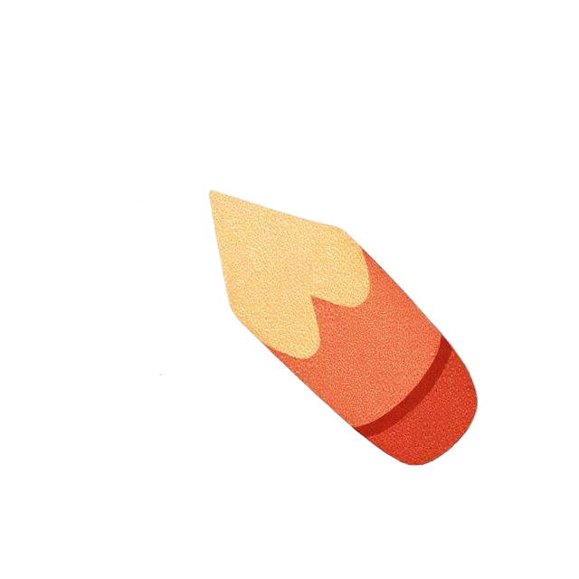
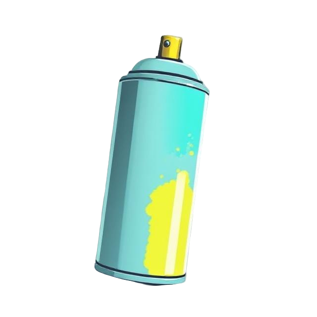
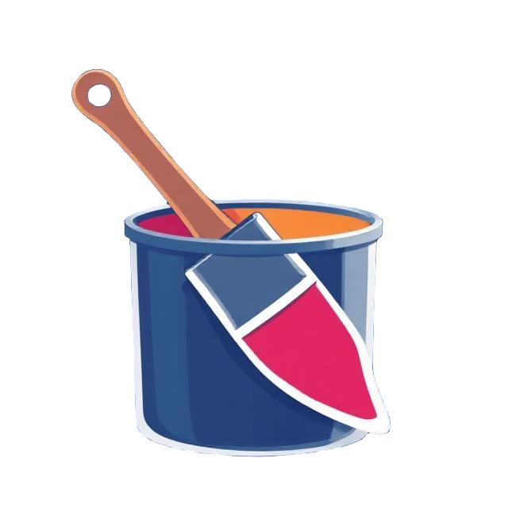
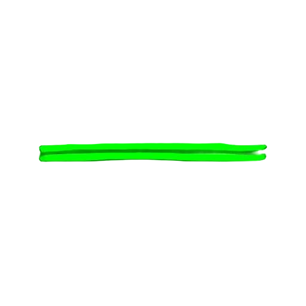
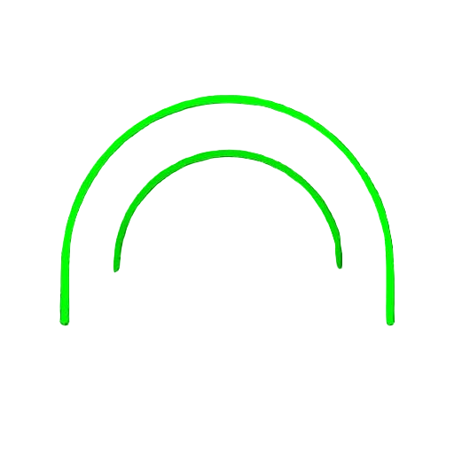

# PaintBar

A free, browser-based drawing application with user profiles, project
management, a community gallery, and NFT minting on the
Hedera / Hiero-Ledger network.

Built by [PandasWhoCode](https://github.com/pandasWhoCode).

## Architecture

| Layer              | Technology                                                                                 |
| ------------------ | ------------------------------------------------------------------------------------------ |
| **Backend**        | Go (net/http)                                                                              |
| **Frontend**       | TypeScript, esbuild (bundler), HTML5 Canvas                                                |
| **Auth**           | Firebase Authentication                                                                    |
| **Database**       | Cloud Firestore (users, projects, gallery, NFTs)                                           |
| **Infrastructure** | Docker Compose, Google Cloud Run, Firebase Hosting                                         |

## Features

### Drawing Tools

-  **Pencil** — Free-form drawing
-  **Eraser** — Free-form eraser
-  **Spray** — Spray-can drawing
-  **Fill** — Flood-fill to colored edges
-  **Text** — Rich text
  (font, size, style, color, rotation)

### Shapes

-  **Rectangle**
-  **Circle**
-  **Line**
-  **Triangle** —
  Equilateral, isosceles, or right angle
-  **Arc** —
  Click-drag endpoint, then set curve depth

### Actions

-  **Clear** canvas
-  **Undo** (Cmd/Ctrl+Z)
-  **Redo** (Cmd/Ctrl+Shift+Z)

### Colors

- Advanced color picker (iro.js wheel + hex input)
- Recent colors palette
- Eyedropper tool (shortcut: I)

### Canvas Settings

- Configurable dimensions (up to 4096×4096)
- Responsive mode with min/max constraints

### Save / Export

- PNG, PNG (transparent), JPG, ICO, ICO (transparent)

### User Profile

- Firebase-authenticated accounts
- Editable profile (display name, bio, location, social links)
- Project management (save, name, edit)
- Community gallery
- NFT minting (Hedera / Hiero-Ledger)

## Getting Started

### Prerequisites

- **Go** 1.25+
- **Node.js** 18+ and npm
- **Docker** and Docker Compose
- **Task** ([taskfile.dev](https://taskfile.dev))

### Setup

```bash
# Clone the repo
git clone https://github.com/pandasWhoCode/paintbar.git
cd paintbar

# Install TS dev dependencies
task ts-install

# Copy Firebase config template and fill in your values
cp web/static/scripts/firebase-config.template.js web/static/scripts/firebase-config.js
cp web/static/scripts/firebase-config.template.js web/ts/shared/firebase-config.ts
# Edit both files with your Firebase project credentials

# Create a .env file
cp .env.example .env

# Build TypeScript and start everything
task dev
```

### Task Commands

#### Server

| Command              | Description                               |
| -------------------- | ----------------------------------------- |
| `task dev`           | Build TS + start Go server                |
| `task run:local`     | Start Docker deps + build TS + run server |
| `task restart:local` | Kill running server + restart             |
| `task stop:local`    | Stop server + Docker deps                 |
| `task build`         | Build Go binary to `bin/`                 |
| `task run`           | Run Go server (no Docker deps)            |

#### TypeScript

| Command              | Description                                     |
| -------------------- | ----------------------------------------------- |
| `task ts-build`      | Build with esbuild (dev, includes source maps)  |
| `task ts-build:prod` | Build with esbuild (production, no source maps) |
| `task ts-check`      | Type-check with tsc (no emit)                   |
| `task ts-install`    | Install TypeScript dev dependencies             |

#### Docker

| Command                      | Description                             |
| ---------------------------- | --------------------------------------- |
| `task docker:up`             | Start Firebase emulator                 |
| `task docker:down`           | Stop Docker services                    |
| `task docker:reset-firebase` | Wipe and restart Firebase emulator only |
| `task docker-clean`          | Stop all + remove all volumes           |
| `task docker-logs`           | Tail container logs                     |

#### Testing

| Command                 | Description                                  |
| ----------------------- | -------------------------------------------- |
| `task test`             | Run all Go tests (with race detector)        |
| `task test-short`       | Run Go tests (skip integration)              |
| `task bench`            | Run Go benchmarks                            |
| `task lint`             | Run all linters (Go, TypeScript, Markdown)   |

#### Deploy

| Command               | Description                                         |
| --------------------- | --------------------------------------------------- |
| `task deploy-preview` | Deploy to Firebase preview channel + Cloud Run      |
| `task deploy-prod`    | Deploy to production                                |
| `task clean`          | Remove build artifacts (`bin/`, `web/static/dist/`) |

## Project Structure

```text
paintbar/
├── cmd/server/          # Go server entrypoint
├── internal/
│   ├── handler/         # HTTP handlers
│   ├── middleware/       # Auth, logging, security middleware
│   ├── repository/      # Firestore data access (Admin SDK)
│   └── service/         # Business logic
├── web/
│   ├── templates/       # Go HTML templates
│   ├── ts/              # TypeScript source
│   │   ├── shared/      # Types, Firebase init, errors
│   │   ├── canvas/      # Drawing tools, managers, app entry
│   │   ├── auth/        # Login entry point
│   │   └── profile/     # Profile entry point
│   └── static/
│       ├── dist/        # esbuild output (gitignored)
│       ├── styles/      # CSS
│       └── images/      # Static assets
├── api/                 # OpenAPI spec
├── docs/                # Documentation
├── Taskfile.yml         # Task runner config
├── docker-compose.yml   # Local dev services
└── Dockerfile           # Production container
```

## Documentation

Detailed documentation for all menus and features: [Menu Documentation](docs/menus.md)

## Browser Compatibility

PaintBar works best in modern browsers that support HTML5 Canvas and ES modules. Not yet compatible with mobile browsers.

## License

Licensed under the Apache License, Version 2.0 — see [LICENSE](LICENSE) for details.
