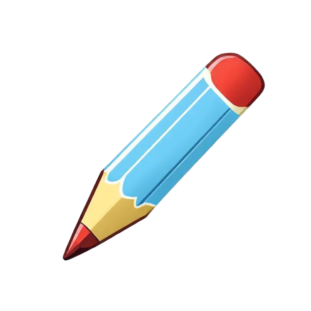
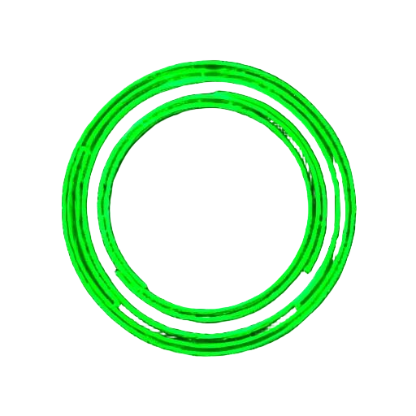
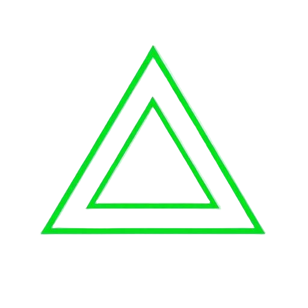

# PaintBar

A modern, web-based drawing application that combines simplicity with powerful features.

## Features

### Canvas Settings
- Configurable canvas dimensions
- Responsive canvas support
  - Auto-resize while maintaining aspect ratio
  - Configurable minimum and maximum dimensions
  - Enable/disable responsive behavior
- Smart tool availability based on canvas size

### Drawing Tools
-  Pencil tool for freehand drawing
-  Eraser tool
-  Fill tool for coloring areas
  - Note: Fill tool requires minimum canvas dimensions (250x250) when responsive mode is disabled
-  Text tool with rich formatting options
- ◰ Selection tool for manipulating drawn elements

### Text Features 
- Rich text formatting:
  - Bold, Italic, Underline, and Strikethrough styles
  - Multiple font families (Arial, Times New Roman, Courier New, Georgia, Verdana)
  - Adjustable font size (8px to 200px)
  - Custom text color
  - Text rotation (0° to 360°)
- Real-time text preview
- Easy text editing and positioning

### Shapes
-  Rectangle tool
-  Circle tool
-  Line tool
-  Triangle tool with multiple types:
  - Right angle
  - Isosceles
  - Equilateral

### Colors
- 🎨 Advanced color picker
- Recent colors palette
- 🔍 Eyedropper tool for color sampling

### Paintbar Actions
-  Clear canvas
-  Undo (Cmd/Ctrl+Z)
-  Redo (Cmd/Ctrl+Shift+Z)
- ◰ Select and manipulate content
- 📏 Grid toggle
- 🔍 Zoom in/out capabilities

### File Operations
- 💾 Multiple save formats:
  - PNG (with/without transparency)
  - JPG
  - ICO (with/without transparency)
- 📋 Copy/Paste support

## Documentation

Detailed documentation for all menus and features can be found in the [Menu Documentation](docs/menus.md) file.

## Getting Started

1. Clone the repository
2. Open `index.html` in your web browser
3. Configure your canvas settings:
   - Set desired canvas dimensions
   - Enable/disable responsive mode
   - Configure min/max dimensions if using responsive mode
4. Start creating!

## Browser Compatibility

PaintBar works best in modern browsers that support HTML5 Canvas and ES6+ JavaScript features.

PaintBar is not compatible with mobile web browsers at this time.

## Dependencies

- html2canvas (v1.4.1) - For image export functionality
- iro.js (v5) - For the color picker interface
- Firebase - For analytics

## Contributing

Feel free to submit issues and enhancement requests!

## License

This project is licensed under the Apache License, Version 2.0 - see the [LICENSE](LICENSE) file for details.
