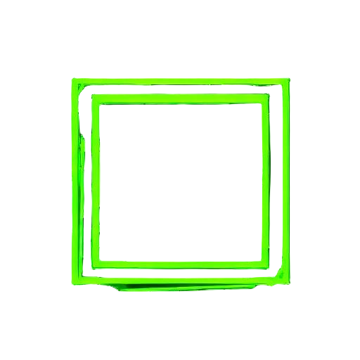

# PaintBar

Welcome to Paintbar! :paintbar: 

We're glad you're here! Paintbar is a brand new tool that is targeting anyone who wants to draw with a simple, free, interface. This project has started off as a free time experiment but I think it will be excellent through the roof.

Paintbar is also an interface to the world of Web3 and NFTs. 

When the product is ready for it's first major version it will support the following features:

A full set of drawing tools
A dedicated user profile
The ability to save, name, and edit projects to your profile
The ability to publish projects to a community gallery in the Paintbar Gallery
The ability sell your art as an NFT on the Hedera / Hiero-Ledger network
The ability to browse all NFTs minted through Paintbar on the Paintbar Browser

For now explore the feature-set that is available today:

## Features

### Tools Menu

-  - Pencil tool :: For free-form drawing
-  - Eraser tool :: Free form eraser
-  - Spray tool :: Free form spray-can drawing
-  - Flood-Fill tool :: Fill to colored edges
-  - Text tool :: Opens the text modal and allows creator to add text to the clicked canvas point.

### Shapes Menu

-  - Rectangle :: Draw a rectangle
-  - Circle :: Draw a circle
-  - Line :: Draw a line
-  - Triangle :: Draw a triangle (choose equilateral, isosceles, or right angle triangle)
-  - Arc :: Draw an arc (click and drag to end point, next click will set the depth and angle of the arc)

### Actions Menu

-  - Clear :: Clear the canvas
-  - Undo :: Undo last operation
-  - Redo :: Redo last operation which was undone

### Colors

- 🎨 Advanced color picker
- Recent colors palette
- 🔍 Eyedropper tool for color sampling

### Size
Set the size of the drawn edges for all tools and shapes (except :text:)

### File
- 💾 Save :: Save the canvas (choose png, transparent png, jpg, ico, transparent ico)

Thank you for supporting PandasWhoCode :pwc: and the Paintbar :paintbar: application! 

### Canvas Settings
- Configurable canvas dimensions
- Responsive canvas support
  - Auto-resize while maintaining aspect ratio
  - Configurable minimum and maximum dimensions
  - Enable/disable responsive behavior
- Smart tool availability based on canvas size

### Text Features 
- Rich text formatting:
  - Bold, Italic, Underline, and Strikethrough styles
  - Multiple font families (Arial, Times New Roman, Courier New, Georgia, Verdana)
  - Adjustable font size (8px to 200px)
  - Custom text color
  - Text rotation (0° to 360°)
- Real-time text preview
- Easy text editing and positioning

## Documentation

Detailed documentation for all menus and features can be found in the [Menu Documentation](docs/menus.md) file.

## Getting Started

1. Clone the repository
2. Open `index.html` in your web browser
3. Configure your canvas settings:
   - Set desired canvas dimensions
   - Enable/disable responsive mode
   - Configure min/max dimensions if using responsive mode
4. Start creating!

## Browser Compatibility

PaintBar works best in modern browsers that support HTML5 Canvas and ES6+ JavaScript features.

PaintBar is not compatible with mobile web browsers at this time.

## Dependencies

- html2canvas (v1.4.1) - For image export functionality
- iro.js (v5) - For the color picker interface
- Firebase - For analytics

## Contributing

Feel free to submit issues and enhancement requests!

## License

This project is licensed under the Apache License, Version 2.0 - see the [LICENSE](LICENSE) file for details.
