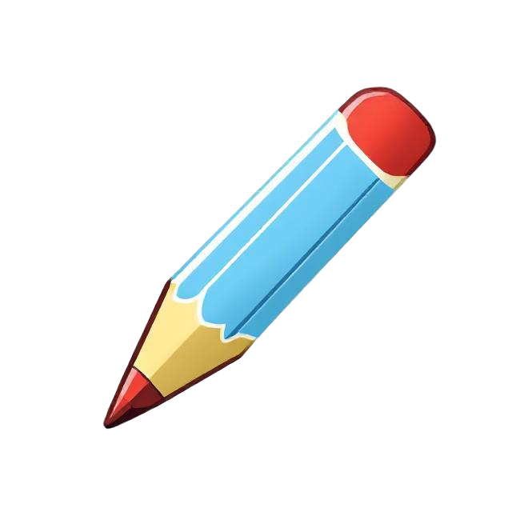
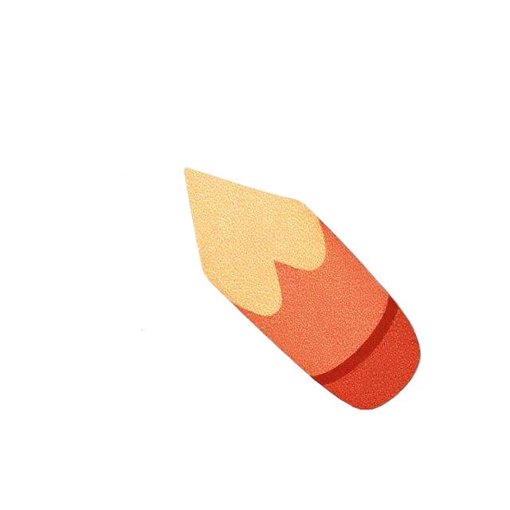
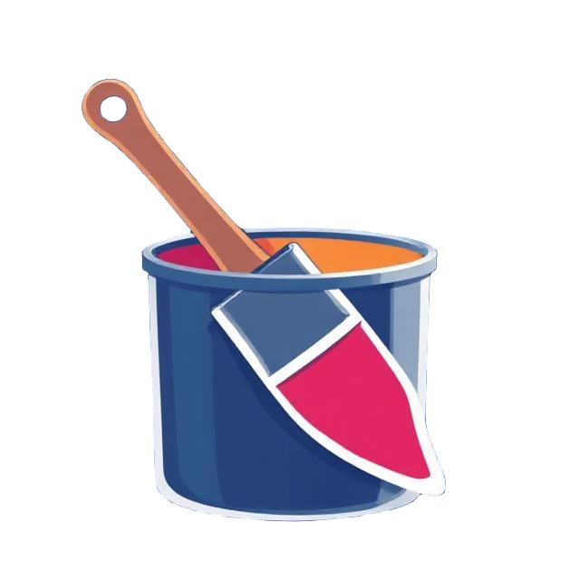
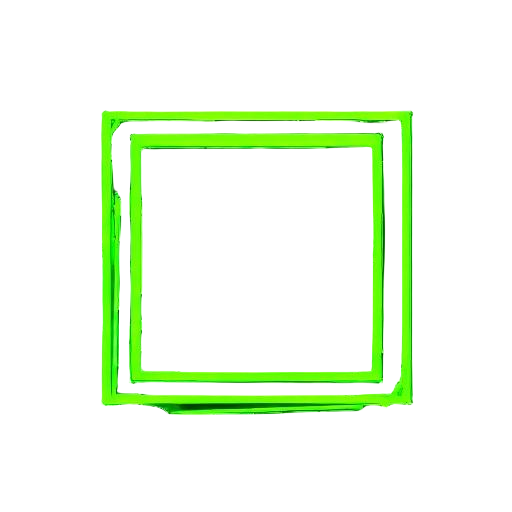
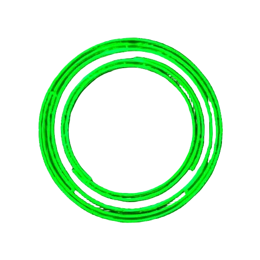
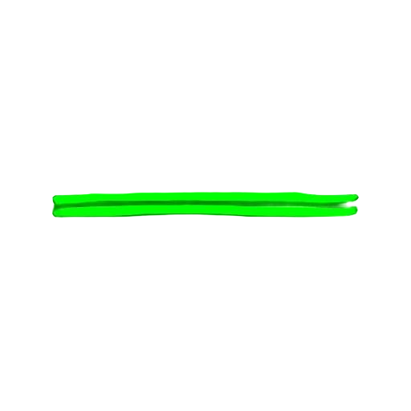
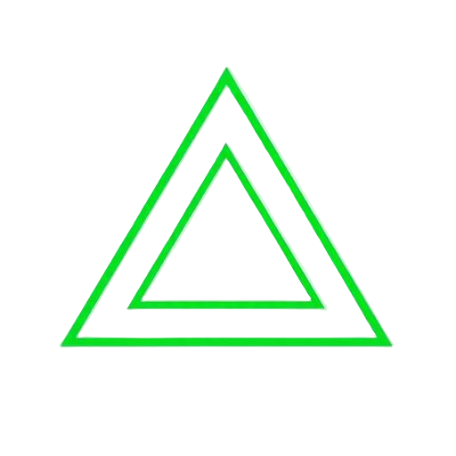
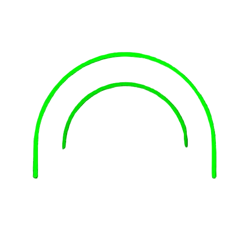
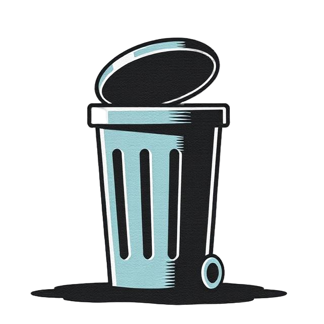

# PaintBar Menu Documentation

This document provides detailed information about all menus and features available in PaintBar.

## Tools Menu

The Tools menu provides essential drawing and manipulation tools for creating artwork in PaintBar.

### Available Tools

####  Pencil
- Primary drawing tool for freehand sketching
- Adjustable line weight using the Size menu
- Pressure sensitivity supported on compatible devices

####  Eraser
- Removes drawn content
- Size adjustable through the Size menu
- Works on all layers

####  Fill
- Floods an enclosed area with the selected color
- Works with both simple and complex shapes
- Respects canvas boundaries and shape edges

####  Text
- Adds text to the canvas
- Rich formatting options:
  - Multiple font families (Arial, Times New Roman, Courier New, Georgia, Verdana)
  - Font sizes from 8px to 200px
  - Bold, Italic, Underline, and Strikethrough styles
  - Custom text color
  - Rotation (0° to 360°)
- Real-time preview in the text modal

## Shapes Menu

The Shapes menu provides a collection of geometric tools for creating precise shapes.

### Available Shapes

####  Rectangle
- Creates rectangular or square shapes
- Click and drag to define dimensions
- Hold Shift for perfect squares

####  Circle
- Creates circular or elliptical shapes
- Click and drag to define dimensions
- Hold Shift for perfect circles

####  Line
- Draws straight lines
- Click and drag to define length and angle
- Hold Shift for horizontal, vertical, or 45-degree angles

####  Triangle
- Creates triangular shapes with three types:
  - Right Angle: Creates a triangle with one 90-degree angle
  - Isosceles: Creates a triangle with two equal sides
  - Equilateral: Creates a triangle with all sides equal
- Select triangle type from the dropdown menu

####  Arc
- Draws curved lines or partial circles
- Click to set center point
- Drag to define radius and arc length

## Actions Menu

The Actions menu provides tools for manipulating and editing content on the canvas.

### Available Actions

#### ◰ Select
- Selects drawn elements for manipulation
- Click and drag to create selection area
- Move, resize, or delete selected content

#### 📐 Crop
- Trims the canvas to a selected area
- Supports preset ratios:
  - 1:1 (square)
  - 9:16 (mobile)
- Custom crop dimensions available

#### 📋 Paste
- Pastes copied or cut content
- Supports system clipboard content
- Maintains original formatting

####  Clear
- Clears the entire canvas
- Warning: This action cannot be undone

####  Undo
- Reverts the last action performed
- Keyboard shortcut: Cmd/Ctrl+Z

####  Redo
- Restores previously undone actions
- Available after using undo
- Keyboard shortcut: Cmd/Ctrl+Shift+Z

#### Transform Tools
- 🔄 Rotate: Rotates selected content
- ↔️ Flip Horizontal: Mirrors content horizontally
- ↕️ Flip Vertical: Mirrors content vertically

## Colors Menu

The Colors menu provides comprehensive color selection and management tools.

### Features

#### Color Picker
- Advanced color selection interface using iro.js
- Visual color wheel for intuitive selection
- RGB and HEX color value display
- Real-time color preview

#### 🔍 Eyedropper
- Sample colors from anywhere on the canvas
- Click to activate, then click any point to sample color
- Shortcut key: 'I'

#### Recent Colors
- Displays recently used colors
- Quick access to frequently used colors
- Automatically updates as you work
- Click any recent color to select it

## Size Menu

The Size menu controls the thickness of drawing tools and shapes.

### Features

#### Line Weight Slider
- Adjusts the thickness of:
  - Pencil strokes
  - Shape outlines
  - Eraser size
- Range: 1px to 100px
- Real-time preview while adjusting

### Usage
1. Open the Size menu
2. Drag the slider left to decrease size
3. Drag the slider right to increase size
4. Changes take effect immediately

## View Menu

The View menu provides tools for adjusting the canvas display and workspace visualization.

### Features

#### 📏 Grid Toggle
- Shows/hides alignment grid
- Helps with precise placement
- Does not appear in exported images

#### Zoom Controls
- 🔍 Zoom In: Increases canvas view size
- 🔎 Zoom Out: Decreases canvas view size
- Maintains image quality at all zoom levels
- Helpful for detailed work and overall composition view

## File Menu

The File menu handles saving and exporting your artwork.

### Features

#### 💾 Save
- Exports your artwork in various formats:
  - PNG (with/without transparency)
  - JPG
  - ICO (with/without transparency)
- Options available in save dialog:
  - Format selection
  - Transparency toggle (for supported formats)
  - Quality settings (for JPG)
- Maintains original resolution
- Preserves all layers in final output
